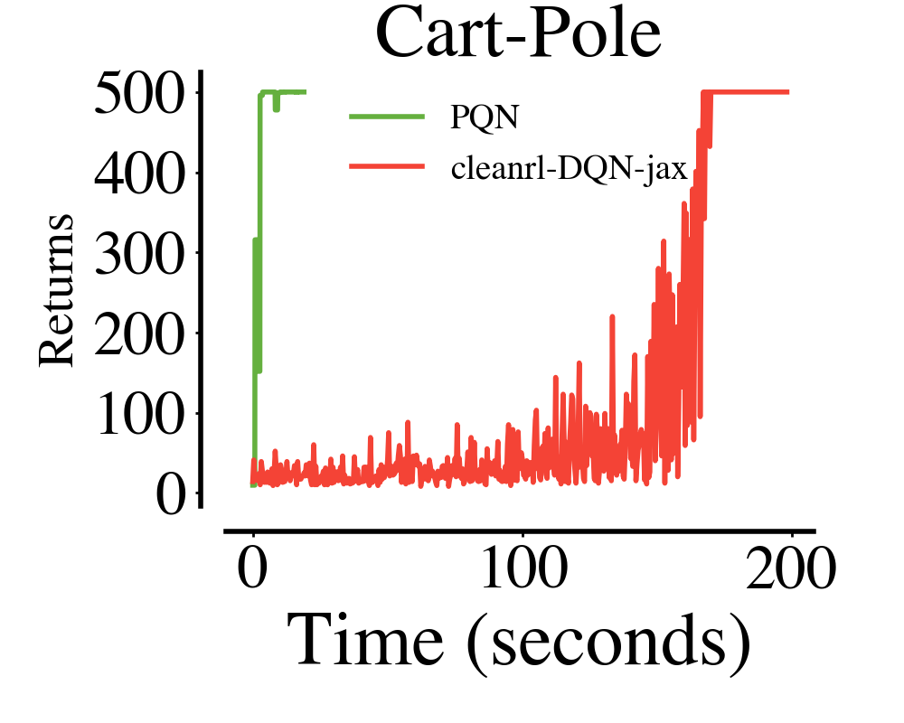
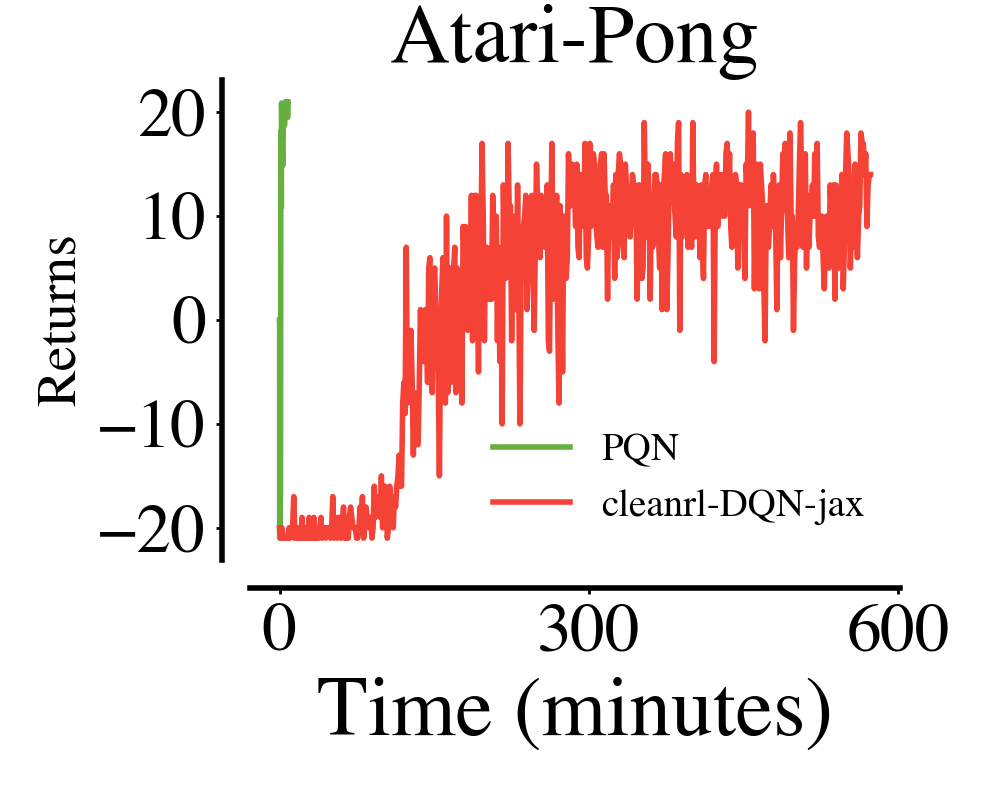
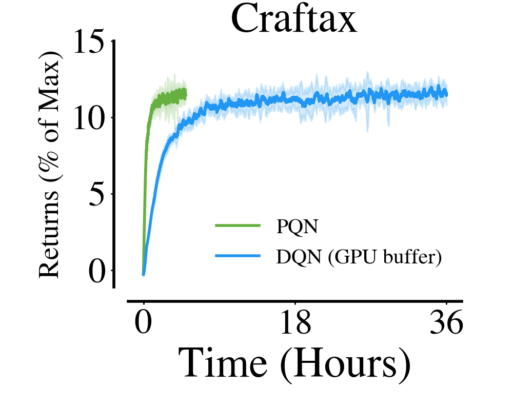
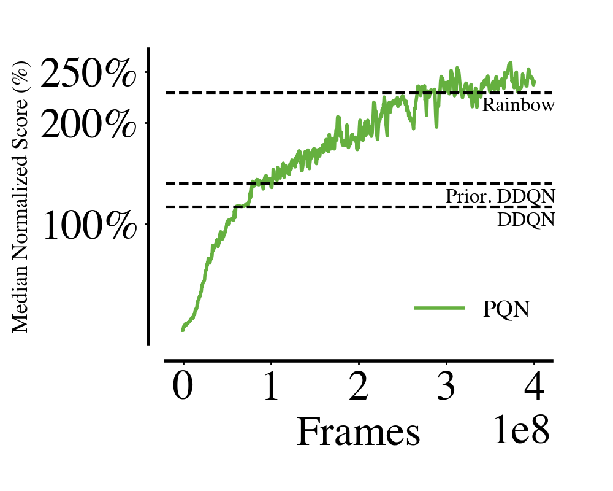
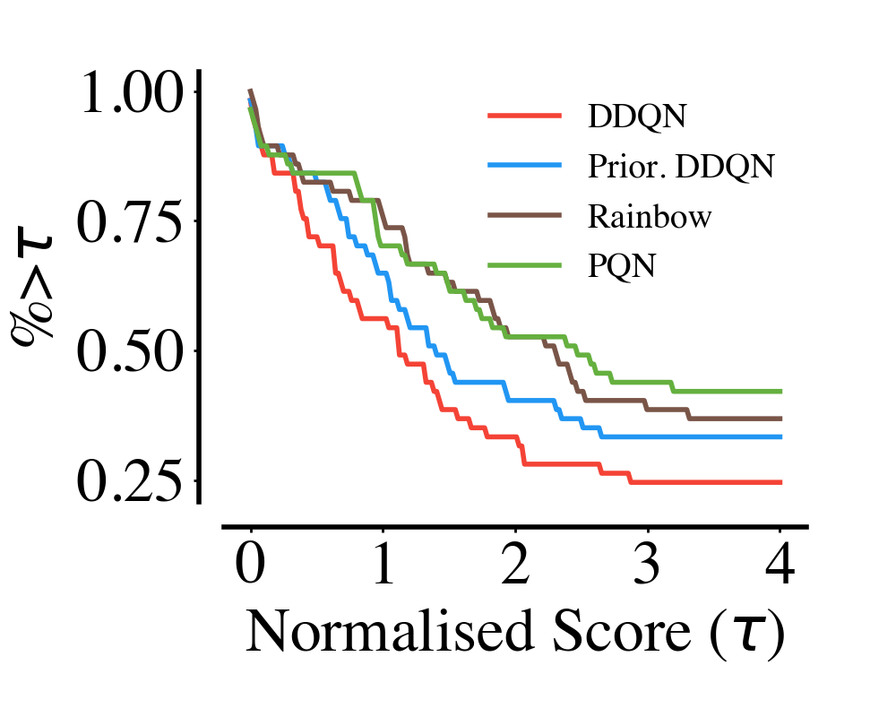
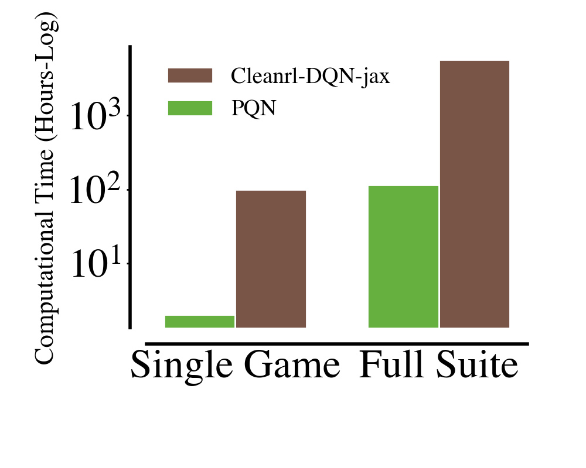
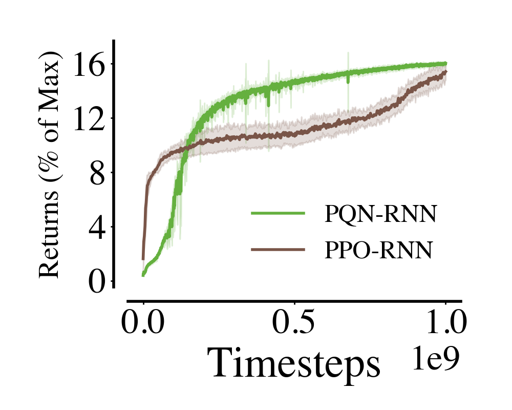
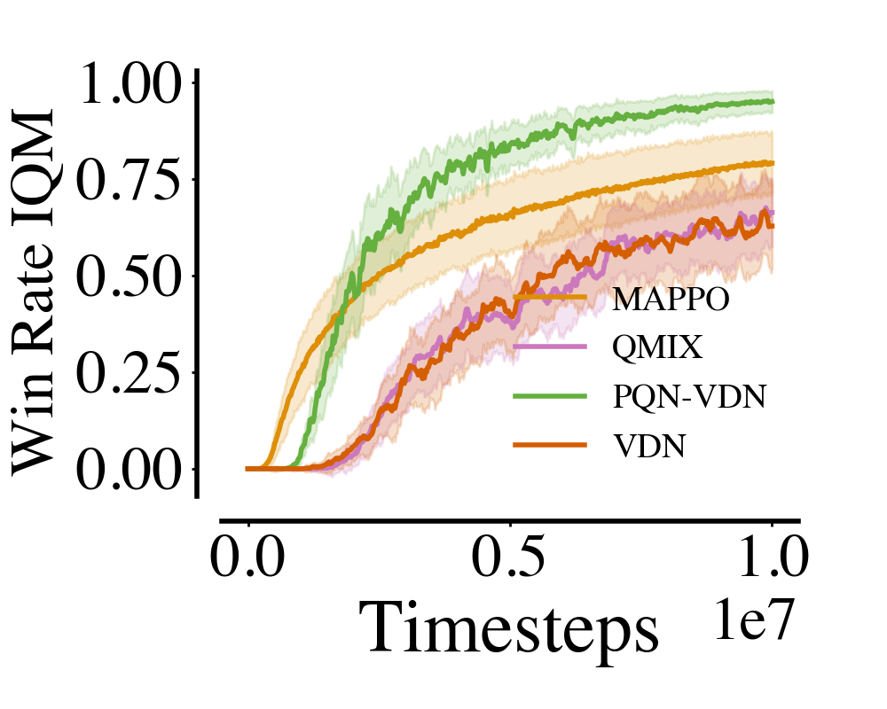
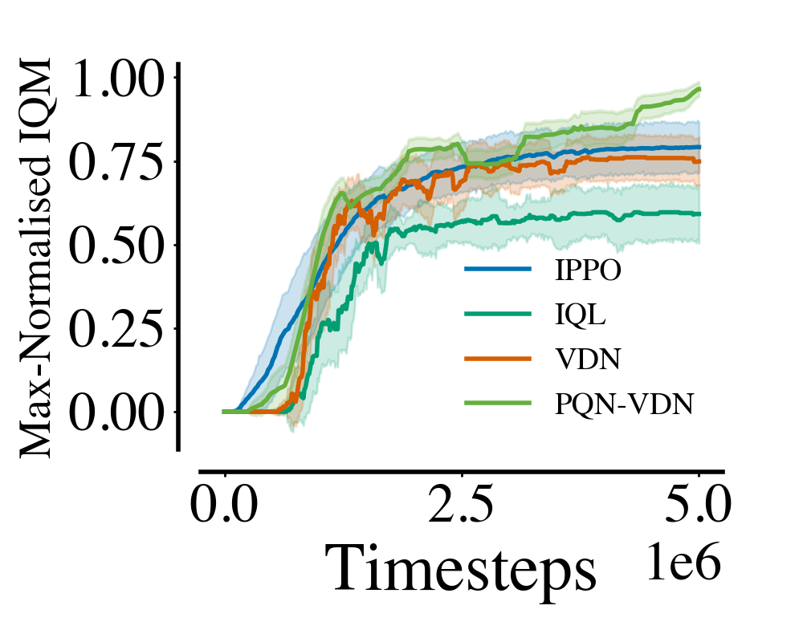
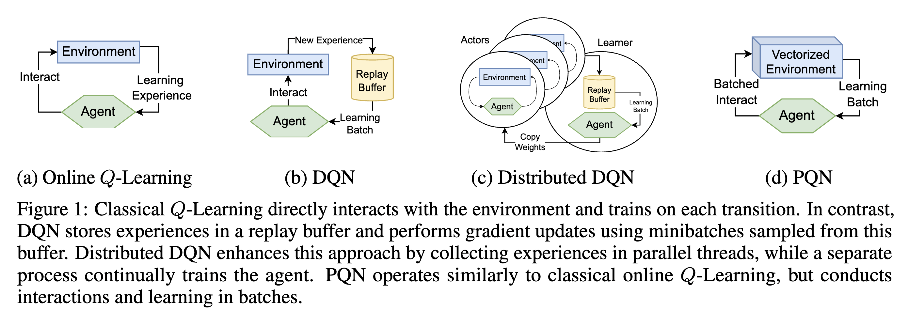

---

title: "Simplifying Deep Temporal Difference Learning"  
date: '2025-02-04'  
summary: "A modern implementation of Deep Q-Network without target networks and replay buffers."  
description: "A modern implementation of Deep Q-Network without target networks and replay buffers."  
toc: true  
readTime: true  
math: true  
tags: ["RL", "parallelisation", "jax"]  
showTags: false  
hideBackToTop: false  
hideHeader: true  
safeMode: unsafe  

---

> This blog provides a general overview of PQN. For a deeper theoretical analysis of PQN, [check out this other blog post](https://blog.foersterlab.com/fixing-td-part-1).

## TL;DR  

We leverage environment vectorisation and network normalisation to train a modern version of Deep Q-Learning that is fast and stable. We call the resulting algorithm **PQN (Parallelised Q-Network)**. The main features of PQN are:  

1. **Simplicity**: PQN is a very simple baseline, essentially an online Q-learner with vectorised environments and network normalisation.  
2. **Speed**: PQN runs without a replay buffer and target networks, ensuring significant speed-ups and sample efficiency.  
3. **Stability**: PQN uses network normalisation to stabilise training.  
4. **Flexibility**: PQN is easily compatible with RNNs, $Q(\lambda)$ returns, and multi-agent tasks. 

**Useful links**

[🚀 Jax implementation](https://github.com/mttga/purejaxql)  
[🔥 PyTorch Cleanrl implementation](https://github.com/vwxyzjn/cleanrl/blob/master/cleanrl/pqn.py)  
[🖥️ Colab Demo](https://colab.research.google.com/github/mttga/mttga.github.io/blob/main/content/posts/pqn/pqn_demo.ipynb)  
[📝 Paper](https://arxiv.org/abs/2407.04811)  


<blockquote class="twitter-tweet" data-theme="dark"><p lang="en" dir="ltr">🚀 We&#39;re very excited to introduce Parallelised Q-Network (PQN), the result of an effort to bring Q-Learning into the world of pure-GPU training based on JAX!<br><br>What’s the issue? Pure-GPU training can accelerate RL by orders of magnitude. However, Q-Learning heavily relies on… <a href="https://t.co/aBA0IPF0By">pic.twitter.com/aBA0IPF0By</a></p>&mdash; Matteo Gallici (@MatteoGallici) <a href="https://twitter.com/MatteoGallici/status/1811656869385060737?ref_src=twsrc%5Etfw">July 12, 2024</a></blockquote> <script async src="https://platform.twitter.com/widgets.js" charset="utf-8"></script>  

## Abstract  

Q-learning has played a foundational role in the field of reinforcement learning (RL). However, TD algorithms with off-policy data, such as Q-learning, or nonlinear function approximation like deep neural networks, require several additional tricks to stabilise training, primarily a replay buffer and target networks. Unfortunately, the delayed updating of frozen network parameters in the target network harms sample efficiency, and similarly, the replay buffer introduces memory and implementation overheads. In this paper, we investigate whether it is possible to accelerate and simplify TD training while maintaining its stability. Our key theoretical result demonstrates for the first time that regularisation techniques such as LayerNorm can yield provably convergent TD algorithms without the need for a target network, even with off-policy data. Empirically, we find that online, parallelised sampling enabled by vectorised environments stabilises training without the need for a replay buffer. Motivated by these findings, we propose PQN, our simplified deep online Q-Learning algorithm. Surprisingly, this simple algorithm is competitive with more complex methods like Rainbow in Atari, R2D2 in Hanabi, QMix in Smax, and PPO-RNN in Craftax, and can be up to 50x faster than traditional DQN without sacrificing sample efficiency. In an era where PPO has become the go-to RL algorithm, PQN re-establishes Q-learning as a viable alternative.  


## ⚡️ Quick Stats  

With PQN and a single NVIDIA A40 (achieving similar performance to an RTX 3090), you can:  
- 🦿 Train agents for simple tasks like CartPole and Acrobot in a few seconds.  
  - Train thousands of seeds in parallel in a few minutes.  
  - Train MinAtar in less than a minute, and complete 10 parallel seeds in less than 5 minutes.  
- 🕹️ Train an Atari agent for 200M frames in one hour (with environments running on a single CPU using [Envpool](https://github.com/sail-sg/envpool), tested on an AMD EPYC 7513 32-Core Processor).  
  - Solve simple games like Pong in a few minutes and less than 10M timesteps.  
- 👾 Train a Q-Learning agent in Craftax much faster than when using a replay buffer.  
- 👥 Train a strong Q-Learning baseline with VDN in multi-agent tasks.  

<table style="width: 100%; text-align: center; border-collapse: collapse;">  
  <tr>  
    <td style="width: 33.33%; vertical-align: top; padding: 10px;">  
      <h3>Cartpole</h3>  
        
      <i>It takes a few seconds to train on simple tasks, even with dozens of parallel seeds.</i>  
    </td>  
    <td style="width: 33.33%; vertical-align: top; padding: 10px;">  
      <h3>Atari</h3>  
        
      <i>With PQN, you can solve simple games like Pong in less than 5 minutes.</i>  
    </td>  
    <td style="width: 33.33%; vertical-align: top; padding: 10px;">  
      <h3>Craftax</h3>  
        
      <i>Training an agent in Craftax with PQN is faster than using a replay buffer.</i>  
    </td>  
  </tr>  
</table>  

## 🦾 Performances  

### 🕹️ Atari  

Currently, after around 4 hours of training and 400M environment frames, PQN can achieve a median score similar to the original Rainbow paper in ALE, reaching scores higher than humans in 40 of the 57 Atari games. While this is far from the latest SOTA in ALE, it can serve as a good starting point for faster research in ALE.  

<table style="width: 100%; text-align: center; border-collapse: collapse;">  
  <tr>  
    <td style="width: 33.33%; vertical-align: top; padding: 10px;">  
      Median Score  
        
    </td>  
    <td style="width: 33.33%; vertical-align: top; padding: 10px;">  
      Performance Profile  
        
    </td>  
    <td style="width: 33.33%; vertical-align: top; padding: 10px;">  
      Training Speed  
        
    </td>  
  </tr>  
</table>  

### 👾 Craftax  

When combined with an RNN network, PQN offers a more sample-efficient baseline compared to PPO. As an off-policy algorithm, PQN could be an interesting starting point for population-based training in Craftax!  

<div style="text-align: center; margin: auto;">  
    
</div>  

### 👥 Multi-Agent (JaxMarl)  

When combined with Value Decomposition Networks, PQN is a strong baseline for multi-agent tasks.  

<table style="width: 100%; margin: auto; text-align: center; border-collapse: collapse;">  
  <tr>  
    <td style="width: 50%; vertical-align: top; padding: 10px;">  
      Smax  
        
    </td>  
    <td style="width: 50%; vertical-align: top; padding: 10px;">  
      Overcooked  
        
    </td>  
  </tr>  
</table>  

## 🧐 How does it work

The idea behind PQN is simple. Originally, DQN used a replay buffer to sample batches of experiences, as training in batches is crucial for deep learning. However, if we can acquire enough experiences directly from a parallelised interaction with an environment and use them for our batches, storing experiences in a replay buffer is no longer necessary. This is the idea behind algorithms like A2C and PPO, and it can be very beneficial in modern pure-GPU training, where we have the ability to sample many experiences in parallel but a limited amount of GPU memory to store them (note that this is the opposite scenario to the one in which DQN was originally implemented, where sampling experiences from single environments on the CPU was expensive, but storing experiences in RAM or on disk was cheap). However, A2C and PPO focus on on-policy algorithms. PQN demonstrates that, if vectorisation is done properly and learning is stabilised via network normalisation, we can apply the same regime used by A2C and PPO to an off-policy algorithm, such as Q-Learning with epsilon-greedy. This effectively brings standard Q-Learning into a pure-GPU regime!

  

To train an off-policy algorithm in a vectorised manner, we need a fast and stable algorithm. This is where network normalisation comes into play. Check out [our other blog post](https://blog.foersterlab.com/fixing-td-part-1), where we delve into the theory behind the role of network normalisation in TD Learning, and we avvocate for the use of Layer Normalisation, showing how it can effectively stabilise training without the need for target networks.


## 👷‍♂️ Code example

Implementing and using PQN is simple. The following self-contained snippet can be used to train fully on GPU PQN in Minatar, including testing, WANDB logging, and running multiple runs (seeds) in parallel on the same GPU. [You can try this code in Colab now!](https://colab.research.google.com/github/mttga/mttga.github.io/blob/main/content/posts/pqn/pqn_demo.ipynb)


<!-- Add this CSS to your blog's stylesheet or inline -->
<style>
  .gist-container {
    background: #1a1a1a; /* Dark background */
    border-radius: 8px;
    padding: 1rem;
    max-height: 400px; /* Adjust height as needed */
    overflow: auto;
    margin: 1rem 0;
  }

  /* Override GitHub's default light theme */
  .gist .blob-wrapper,
  .gist .gist-meta {
    background: #1a1a1a !important;
    color: #e6e6e6 !important;
  }
  
  .gist .highlight {
    background:rgb(20, 20, 20) !important;
  }

  .gist .pl-smi,
  .gist .pl-ent {
    color: #e6e6e6 !important;
  }

  /* syntax colors */
  .gist .blob-code {
    color: #e6e6e6 !important;
  }
  .gist .pl-s { /* strings */
    color:rgb(43, 180, 225) !important;
  }
  .gist .pl-k { /* keywords */
    color: #ff7b72 !important;
  }

  /* Scrollbar styling */
  ::-webkit-scrollbar {
    width: 8px;
  }

  ::-webkit-scrollbar-track {
    background: #2d2d2d;
  }

  ::-webkit-scrollbar-thumb {
    background: #4d4d4d;
    border-radius: 4px;
  }
</style>

<!-- Container for the Gist -->
<div class="gist-container">
  <script src="https://gist.github.com/mttga/32c5adb6f5290244a190d94278ece6a3.js"></script>
</div>

---


## Related Projects

The following repositories are related to pure-GPU RL training:

- [PureJaxRL](https://github.com/luchris429/purejaxrl)
- [JaxMARL](https://github.com/FLAIROx/JaxMARL)
- [Jumanji](https://github.com/instadeepai/jumanji)
- [JAX-CORL](https://github.com/nissymori/JAX-CORL)
- [JaxIRL](https://github.com/FLAIROx/jaxirl)
- [Pgx](https://github.com/sotetsuk/pgx)
- [Mava](https://github.com/instadeepai/Mava)
- [XLand-MiniGrid](https://github.com/corl-team/xland-minigrid)
- [Craftax](https://github.com/MichaelTMatthews/Craftax/tree/main)

## Citation  

```  
@misc{gallici2024simplifyingdeeptemporaldifference,  
      title={Simplifying Deep Temporal Difference Learning},  
      author={Matteo Gallici and Mattie Fellows and Benjamin Ellis and Bartomeu Pou and Ivan Masmitja and Jakob Nicolaus Foerster and Mario Martin},  
      year={2024},  
      eprint={2407.04811},  
      archivePrefix={arXiv},  
      primaryClass={cs.LG},  
      url={https://arxiv.org/abs/2407.04811},  
}  
```  