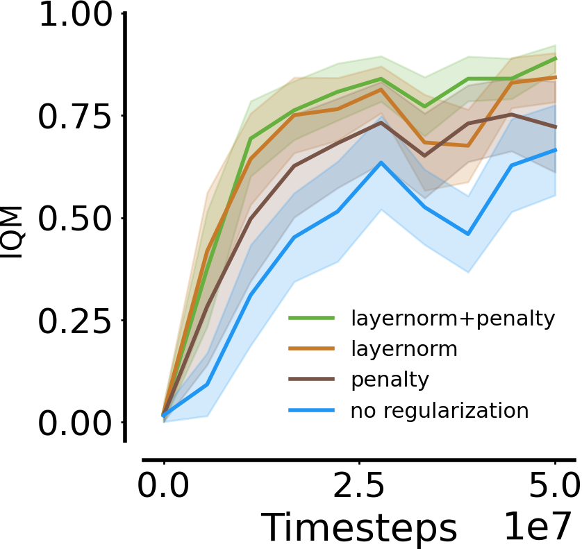
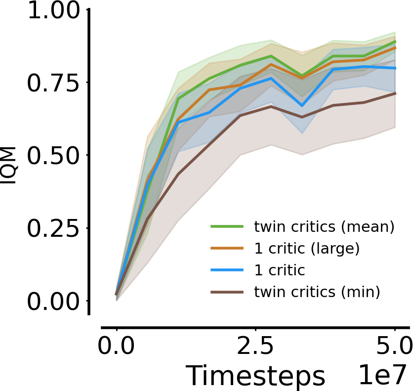
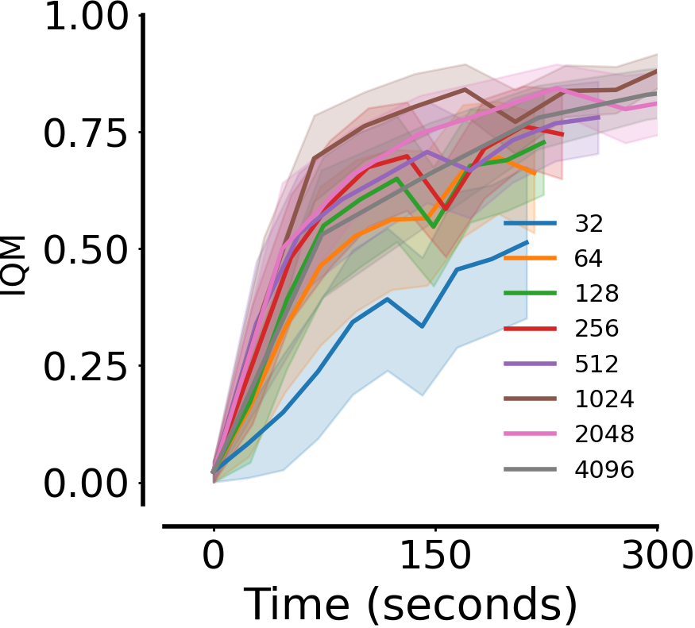
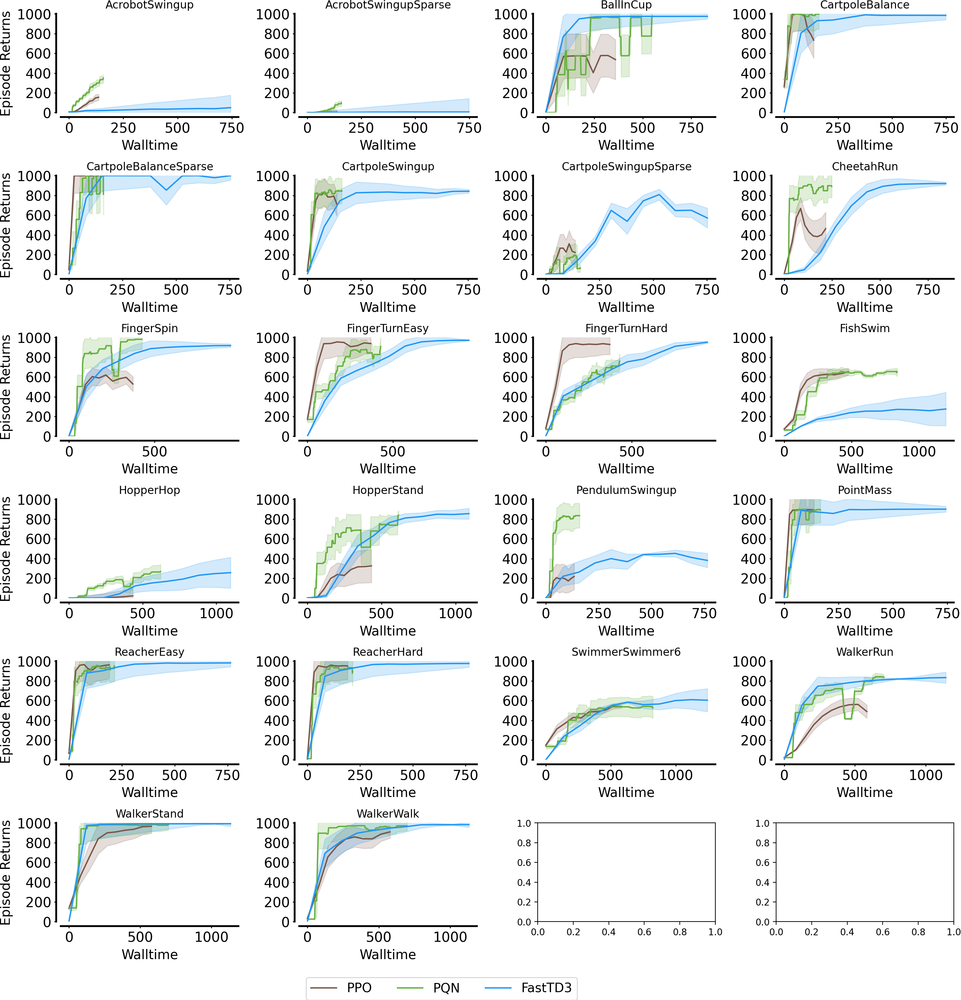
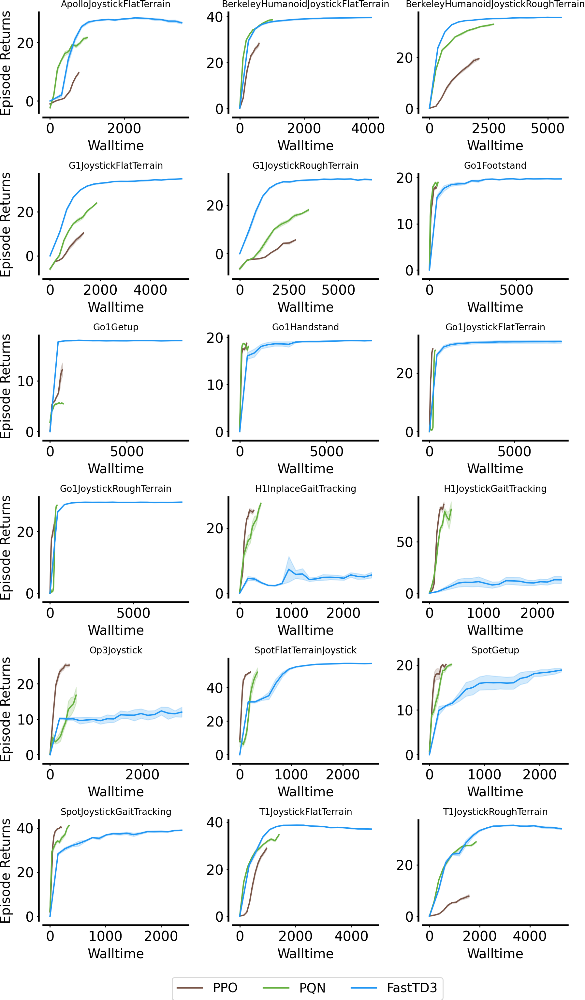
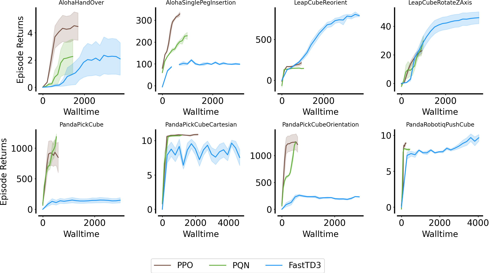

---

title: "Parallel Q-Networks for Continuous Action Spaces"  
date: '2025-11-10'  
summary: "Extension of PQN to continuous action spaces."  
description: "Extending Parallel Q-Networks to continuous action control domains with an actor–critic formulation and full parallelisation."  
toc: false  
readTime: true  
math: true  
tags: ["RL", "parallelisation", "jax"]  
showTags: false  
hideBackToTop: false  
hideHeader: true  
safeMode: unsafe  

---

<div style="text-align: center; margin: 0 auto;"> 
  <video src="images/dm_suite_grid.mp4" alt="dm_suite_grid" width="1200" style="max-width: 100%; display: block; margin: 0 auto;" autoplay loop muted playsinline/>  
</div> 


<div style="text-align: center; margin: 0 auto;"> 
  <video src="images/locomotion_grid.mp4" alt="dm_suite_grid" width="1200" style="max-width: 100%; display: block; margin: 0 auto;" autoplay loop muted playsinline/>  
</div> 

<div style="text-align: center; margin: 0 auto;"> 
  <video src="images/manipulation_grid.mp4" alt="dm_suite_grid" width="1200" style="max-width: 100%; display: block; margin: 0 auto;" autoplay loop muted playsinline/>  
</div> 

We are excited to announce the extension of **Parallel Q-Networks (PQN)** to **continuous action control**. As always, PQN relies on **parallelisation and network normalisation**—no replay buffers, no target networks. Just **basic Q-learning**, now combined with a **deterministic actor** trained jointly with the critic in standard DDPG-style.

Exploration is achieved by injecting **Gaussian noise off-policy**, while **stability** emerges naturally from **Layer Normalisation and large-scale parallelisation**. PQN for continuous control runs in seconds or minutes and can scale to a wide variety of robotic and control tasks within MuJoCo playground, making the resulting policies directly transferable to real robots.

<div style="text-align: center;">

[🚀 **jax implementation** 🚀](https://github.com/mttga/purejaxql/blob/main/purejaxql/pqn_mujoco_playground.py)  

</div>

---

## ⚡️ quick stats  

We evaluate **Actor–Critic PQN** across three main domains of Mujoco Playground, for a total of 50 tasks:

1. **DeepMind Control Suite** – Classic continuous control benchmarks including *CartPole*, *Walker*, *Cheetah*, and *Hopper*.  
2. **Locomotion Tasks** – Control of quadrupeds and humanoids such as *Unitree Go1*, *Boston Dynamics Spot*, *Google Barkour*, *Unitree H1/G1*, *Berkeley Humanoid*, *Booster T1*, and *Robotis OP3*.  
3. **Manipulation Tasks** – Prehensile and non-prehensile manipulation using robotic arms and hands, such as the *Franka Emika Panda* and *Robotiq gripper*.  

Our baselines include PPO (the original implementation from [mujoco playground](https://github.com/google-deepmind/mujoco_playgrond)) and [FastTD3](https://younggyo.me/fast_td3/) (the state-of-the-art off-policy algorithm for continuous control, using target networks and replay buffers).

Following results are averaged across 5 seeds and training all algorithms for a maximum of 1e8 environment steps using H100 GPUs.
 

<table style="width: 100%; text-align: center; border-collapse: collapse;">  
  <tr>  
    <td style="width: 33.33%; vertical-align: top; padding: 10px;">  
      <h3>DM Suite</h3>  
        
      <i>CartPole, Walker, Cheetah, Hopper, ...</i>  
    </td>  
    <td style="width: 33.33%; vertical-align: top; padding: 10px;">  
      <h3>Locomotion</h3>  
        
      <i>Unitree Go1, H1/G1, Booster T1, Berkeley Humanoid, ...</i>  
    </td>  
    <td style="width: 33.33%; vertical-align: top; padding: 10px;">  
      <h3>Manipulation</h3>  
        
      <i>Franka Emika Panda, Robotiq gripper, ...</i>  
    </td>  
  </tr>  
</table> 

---

## 🎭 actor–critic PQN  

PQN can be naturally extended to continuous action spaces by adopting an **actor–critic** framework, in which an additional deterministic actor network is trained jointly with the $Q$-network (critic).  
This configuration closely resembles the Deep Deterministic Policy Gradient (DDPG), while preserving PQN’s **online**, **parallelised**, and **normalised** structure.  

PQN remains a strong and minimal baseline for continuous control, without requiring additional regularisation such as twin delayed target networks, entropy bonuses, replay buffers, or other stabilisation tricks from TD3 and SAC.  

### critic update  

The critic $Q_\phi(s,a)$ is trained exactly as in the discrete version of PQN, by minimising the regularised temporal-difference loss over $\lambda$-returns. We use standard huber loss in this case.

### actor update  

The actor $\pi_\theta(s)$ is trained to produce deterministic actions that maximise the critic's estimated $Q$-values:

<p>$$\mathcal{L}_\text{actor} = -\mathbb{E}_{s_t}\big[ Q_\phi(s_t, \pi_\theta(s_t)) \big].$$</p>

### exploration

Exploration in continuous control is achieved by perturbing the deterministic policy with **additive Gaussian noise** rather than using $\epsilon$-greedy exploration. Specifically,

<p>$$a_t = \pi_\theta(s_t) + \mathcal{N}(0, \sigma_t^2),$$</p>

where $\mathcal{N}$ denotes a Gaussian distribution with decaying standard deviation $\sigma_t$, analogous to the decaying $\epsilon$ in discrete control.

### stability  

To further stabilise online training, we can regularise large deviations in the actor's output. The actor loss becomes:

<p>$$\mathcal{L}_{\text{actor}} = - Q_\phi(s_t, \pi_{\theta}(s_t)) + \beta  \max\big(0, |\pi_{\theta}(s_t) - \tilde{a}_t| - \tau \big)^2,$$</p>

where $\tilde{a}_t$ is the previous (noise-free) action, $\beta$ controls the penalty, and $\tau$ is the deviation threshold. In simple words, when the actor's output deviates too much from the last action taken, a quadratic penalty is applied to discourage large jumps in action space.

Despite this mild regularisation, the **primary stabilising factors** remain **Layer Normalisation** within networks and **large-scale vectorisation**, which ensures diverse and ergodic sampling.

---

## 🔬 ablations  

We perform ablation studies in the DeepMind Control Suite to isolate the contribution of each design component.  

1. **LayerNorm and Actor Regularisation** – Both independently improve stability; the best results are achieved when they are combined.  
2. **Twin Critics** – As in TD3, using two critics to mitigate overestimation actually harms performance in this setting. Averaging across a critic ensemble performs slightly better, but similar results can be achieved by simply widening the critic.  
3. **Vectorisation Scale** – Increasing the number of parallel environments (up to thousands) significantly enhances stability and convergence speed, mirroring the discrete PQN findings.  

<table style="width: 100%; text-align: center; border-collapse: collapse;">
  <tr>
    <td style="width: 33.33%; padding: 10px;">
      
      <i>Stabilisation ablation</i>
    </td>
    <td style="width: 33.33%; padding: 10px;">
      
      <i>Critic type ablation</i>
    </td>
    <td style="width: 33.33%; padding: 10px;">
      
      <i>#Environments ablation</i>
    </td>
  </tr>
</table>

---

## 👾 purejaxql

We now provide a unified repository where you can train **PQN** across a wide range of tasks — from **Atari**, **Craftax**, and **multi-agent** domains to the new **robotic control tasks** powered by **Actor–Critic PQN**.  

- [minatar](https://github.com/mttga/purejaxql/blob/main/purejaxql/pqn_minatar.py)
- [atari](https://github.com/mttga/purejaxql/blob/main/purejaxql/pqn_atari.py)
- [craftax](https://github.com/mttga/purejaxql/blob/main/purejaxql/pqn_rnn_craftax.py)
- [multi-agent tasks](https://github.com/mttga/purejaxql/blob/main/purejaxql/pqn_vdn_rnn_jaxmarl.py)
- [continuous control](https://github.com/mttga/purejaxql/blob/main/purejaxql/pqn_mujoco_playground.py)


### simplified jax scripts
Additionally, we now also provide simplified jax scripts at purejaxql/simplified for smoothing the jax learning curve. These scripts are designed to be more accessible and easier to understand for those who are new to JAX. They cover basic implementations of PQN for various environments, including MinAtar, Atari and Mujoco Playground:

- [minatar](https://github.com/mttga/purejaxql/blob/main/purejaxql/simplified/pqn_minatar_simple.py)
- [atari](https://github.com/mttga/purejaxql/blob/main/purejaxql/simplified/pqn_atari_simple.py)
- [continuous control](https://github.com/mttga/purejaxql/blob/main/purejaxql/simplified/pqn_mujoco_playground_simple.py)


---

## complete results

Following results are averaged across 5 seeds and training all algorithms for a maximum of 1e8 environment (5e7 for FastTD3 and PQN in DM Suite) steps using H100 GPUs. PQN performs very well on most of DMSuite and Locomotion tasks, but seems to struggle more in the manipulation domain. Some environments are not included in the plots since we were not able to replicate original results, or the environment consistently returned NaN rewards during training. These include:

- DM Suite: HumanoidStand, HumanoidWalk, HumanoidRun
- Locomotion: BarkourJoystick.
- Manipulation: PandaOpenCabinet.

<div style="text-align: center; margin: 0 auto;"> 
  <h3>DM Suite</h3>
    
</div> 

<div style="text-align: center; margin: 0 auto;">  
  <h3>Locomotion</h3>
    
</div> 


<div style="text-align: center; margin: 0 auto;">
  <h3>Manipulation</h3>
  
</div>

---


## code example

<!-- Add this CSS to your blog's stylesheet or inline -->
<style>
  .gist-container {
    background: #1a1a1a; /* Dark background */
    border-radius: 8px;
    padding: 1rem;
    max-height: 400px; /* Adjust height as needed */
    overflow: auto;
    margin: 1rem 0;
  }

  /* Override GitHub's default light theme */
  .gist .blob-wrapper,
  .gist .gist-meta {
    background: #1a1a1a !important;
    color: #e6e6e6 !important;
  }
  
  .gist .highlight {
    background:rgb(20, 20, 20) !important;
  }

  .gist .pl-smi,
  .gist .pl-ent {
    color: #e6e6e6 !important;
  }

  /* syntax colors */
  .gist .blob-code {
    color: #e6e6e6 !important;
  }
  .gist .pl-s { /* strings */
    color:rgb(43, 180, 225) !important;
  }
  .gist .pl-k { /* keywords */
    color: #ff7b72 !important;
  }

  /* Scrollbar styling */
  ::-webkit-scrollbar {
    width: 8px;
  }

  ::-webkit-scrollbar-track {
    background: #2d2d2d;
  }

  ::-webkit-scrollbar-thumb {
    background: #4d4d4d;
    border-radius: 4px;
  }
</style>

<!-- Container for the Gist -->
<div class="gist-container">
  <script src="https://gist.github.com/mttga/1b0cb1c48414b5f0a66385da47ce3106.js"></script>
</div>


---

## 📦 Related Projects  

- [Mujoco Playground](https://github.com/google-deepmind/mujoco_playgrond)
- [FastTD3](https://younggyo.me/fast_td3/) 
- [PureJaxRL](https://github.com/luchris429/purejaxrl)  
- [JaxMARL](https://github.com/FLAIROx/JaxMARL)  
- [Jumanji](https://github.com/instadeepai/jumanji)  
- [JAX-CORL](https://github.com/nissymori/JAX-CORL)  
- [JaxIRL](https://github.com/FLAIROx/jaxirl)  
- [Pgx](https://github.com/sotetsuk/pgx)  
- [Mava](https://github.com/instadeepai/Mava)  
- [XLand-MiniGrid](https://github.com/corl-team/xland-minigrid)  
- [Craftax](https://github.com/MichaelTMatthews/Craftax/tree/main)

---

## Citation  

```  
@article{Gallici25simplifying,
    title={Simplifying Deep Temporal Difference Learning},
    author={Matteo Gallici and Mattie Fellows and Benjamin Ellis
     and Bartomeu Pou and Ivan Masmitja and Jakob Nicolaus Foerster
      and Mario Martin},
    year={2025}, 
    eprint={2407.04811},
    journal={The International Conference on Learning Representations (ICLR)},
    primaryClass={cs.LG},
    url={https://arxiv.org/abs/2407.04811},
}
``` 

```  
Notice:
 
PQN for Continuous Control will be included 
in a new version of the above paper after review.
``` 
